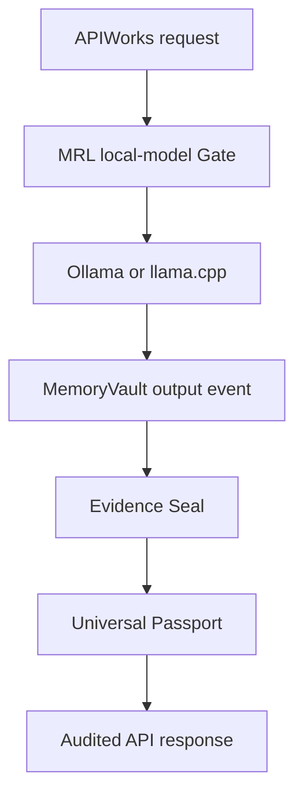

# MRL AI Mother Autonomous Runtime Architecture v1

## Top-level position

```text
MRL_MotherModel_v0_1 (existing evidence/recovery mother)
└─ MRL_AI_Mother_Autonomous_Runtime_Baseline_v1
   ├─ Local model boundary
   ├─ MemoryVault hash chain
   ├─ Evidence Ledger hash chain
   ├─ Universal Passport Registry
   └─ APIWorks Gateway
```

The package is additive. It does not rename or overwrite the existing mother model, `llm_gateway.py`, `FluinMemoryVault.py`, EvidenceVault, or any existing hardware-specific WaveStack. Later integration may adapt those modules behind the interfaces created here.

The canonical deployment boundary is hardware-neutral: GitHub distributes the construction package, MRL distributes a separately checksummed model release, and the customer runs both on hardware they control. Local records do not leave that hardware unless the customer explicitly builds and submits an MRL return bundle.

## Runtime flow



Before local inference, the user input is recorded in MemoryVault. If inference fails, a FAIL Evidence event is appended and no successful Passport is issued. If inference succeeds, the output is recorded, a PASS Evidence event links both memory hashes, and a candidate-world Passport retains the session as `source_identity`.

## Autonomy boundary

The runtime enforces:

- local model endpoint hostname must be `127.0.0.1`, `localhost` or `::1`;
- backend must be `ollama` or `llamacpp`;
- model identity must be explicit;
- external model SDKs are not runtime dependencies;
- a deterministic stub never counts as model acceptance;
- the baseline gateway binds to loopback and must be exposed only through a separately governed proxy;
- production credentials are not stored in code or configuration examples.

This establishes **runtime autonomy**, not a claim that every underlying model weight or training datum originated inside MRL. Weight lineage, license, training corpus and fine-tuning evidence belong in a later Model Passport.

## Persistence model

Memory and Evidence are independent JSONL ledgers. Each record includes:

- ledger ID;
- monotonic sequence;
- previous record hash;
- UTC recording time;
- payload;
- `origin_signature`;
- SHA-256 record hash.

Universal Passports use a separate additive version chain. `source_identity` is mandatory and is never inferred from the canonical name.

## Extension points

1. Replace JSONL with the existing BaseWorld PostgreSQL adapter while retaining hash semantics.
2. Add the MRL Particle Encoder before the local model request.
3. Add corpus retrieval with source and rights filtering.
4. Connect FlowAgent tool execution and durable replay.
5. Add signed Passport transitions and canonical-world Evidence Gate.
6. Expose through APIWorks after authentication, rate-limit, billing and privacy Gates exist.
7. Connect CareOS only after its data classification and consent Gate is defined.
